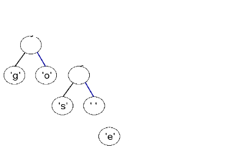

# huffman-coding

## This is my implementation of [Huffman coding](https://engineering.purdue.edu/ece264/17au/hw/HW13?alt=huffman) - a famous compression algorithm

## Getting Started

To compile the code run:  
`make`

## Usage
`./encode <txt file>`  
`./decode <huff file>`  

<br>

## Checked for memory leaks with Valgrind
`valgrind --leak-check=full ./encode example.txt`  
`valgrind --leak-check=full ./decode example.txt.huff`

<br>

## Example

### Note that typically, the compressed file size is around 50-60% of the original text file size. However, in the case of the small file "example.txt," the compressed file turns out larger. This happens because the header, which contains information about the compressed data, takes up a significant portion relative to the file's actual content.

example.txt contains the text "go go gophers".

`./encode example.txt`  
output:
```
Character:g, Encoded:00  
Character:o, Encoded:01  
Character:s, Encoded:100  
Character: , Encoded:101  
Character:e, Encoded:1100  
Character:h, Encoded:1101  
Character:p, Encoded:1110  
Character:r, Encoded:1111  

Successfully encoded the file!  
example.txt.huff is 192.31% the size of example.txt
```

`./decode example.txt.huff`  
output:  
```
Successfully decoded example.txt.huff into decoded_example.txt!
```

<br>

## Encoding explained
```c
// Populate a frequency table for a given file's content (how many times each character is encountered in the file)
void populateFrequencyTable(FILE *fp_in_file, int *frequency_table);
```

"go go gophers"

| Character | Frequency |
|----------|----------|
| frequncy_table[' '] | 2 |
| frequncy_table['e'] | 1 |
| frequncy_table['g'] | 3 |
| frequncy_table['h'] | 1 |
| frequncy_table['o'] | 3 |
| frequncy_table['p'] | 1 |
| frequncy_table['r'] | 1 |
| frequncy_table['s'] | 1 |

The frequencies of the other characters are set to 0.  

```c
// Create a priority queue from a frequency table (priority queue where Huffman tree nodes are sorted by their character's frequency).
// Returns the head of the queue or NULL if unsuccessful.
priority_queue_element *frequencyTableToPriorityQueue(int *frequency_table);
```
Insert all the characters with freqency greater than 0 into the Priority queue.  


```c 
// Transform a priority queue into a Huffman tree and free the memory used by the queue. Returns the root of the tree or NULL if unsuccesful.
node *priorityQueueToHuffmanTree(priority_queue_element **p_priority_queue);
```

Sum all the nodes in the queue until only one remains - the root of the Huffman tree.


```c
// Recursively traverse the Huffman tree and encode characters and store their binary representation (path in the tree) in encoded_characters_table.
// Returns the total number of nodes in the tree, which is saved in the header of the compressed file, so that the tree can be reconstructed when decoding.
unsigned short int populateEncodedCharactersTable(node *root, int tree_level,
        char encoded_characters_table[NUM_ASCII][MAX_ENCODED_CHARACTER_LENGTH]);

```

  

Use a 2D array table to store characters and their Huffman binary codes, because otherwise would have to blindly traverse the whole tree for every character when encoding the message.

*__encoded_characters_table[leaf->character]__* = *__path to the leaf__*  
where going to the left subtree is coded as '0' and to the right as '1'.

| Character | Binary code |
|----------|----------|
| encoded_characters_table[' '] | "101" |
| encoded_characters_table['e'] | "1100" |
| encoded_characters_table['g'] | "00" |
| encoded_characters_table['h'] | "1101" |
| encoded_characters_table['o'] | "01" |
| encoded_characters_table['p'] | "1110" |
| encoded_characters_table['r'] | "1111" |
| encoded_characters_table['s'] | "100" |
 

```c
/*
*  Write the header of the compressed file, needed when decoding it,
*  includes the size of the input file as long int, the size of the Huffman tree as sort unsigned int and the serialized Huffman tree.
*  Returns EOF if unsucessful.
*/
int writeHeader(FILE *fp_out_file, long in_file_size, unsigned short int tree_size, node *root);
```
For this example it is:  
- 00001011 00000000 00000000 00000000 00000000 00000000 00000000 00000000 - 13 - the number of characters in "go go gophers"  
- 00001111 00000000 - 15 - the number of nodes in the Huffman tree  
- 1 01100111 1 0110111 0 1 01110011 1 00100000 0 1 01100101 1 01101000 0 0111000 1 01110010 0 0 0 0 - 1g1o01s1 01e1h01p1r0000 - the serialized Huffman tree, where leaves are stored as 1 followed by the ascii code for the character and parent nodes are stored as 0.


```c
// Encode a file using the Huffman tree built from it. Returns EOF if unsucessful.
int writeEncodedFileContent(char encoded_characters_table[NUM_ASCII][MAX_ENCODED_CHARACTER_LENGTH], FILE *fp_in_file,
                            FILE *fp_out_file);
```
Read the input txt file char by char and store each char's binary code from `ecoded_characters_table` in the encoded file.  

For this example "go go gophers" becomes  
00 01 101 00 01 101 00 01 1110 1101 1100 1111 100

### Note that all the 0s and 1s are stored as bits and not bytes in the encoded file so that they take up less disk space.
This is achieved by using the functions `writeBitToFile()` and `writeCharToFile()` that allow us to accumulate bits until a byte is filled and write it into the encoded file.

<br>

## Decoding explained

```c
// Reconstruct the serialized Huffman tree in the header of the compressed file. Returns the root of the tree or NULL if unsuccessful.
node *ReconstructHuffmanTree(FILE *fp_in_file, unsigned short int tree_size);
```

This is achieved using a stack.  

1g1o01s1 01e1h01p1r0000 - serialized Huffman tree in the header of the encoded file  

1g - push 'g'  


1o - push 'o'  
  

0  - pop 'o' and 'g' and push their parent  
  

1s - push 's'  
  

1 space - push ' '  
  

0  - pop ' ' and 's' and push their parent  
  

1e - push 'e'  
  

1h - push 'h'  
  

0  - pop 'e' and 'h' and push their parent  
  

1p - push 'p'  
  

1r - push 'r'  
  

0 - pop 'r' and 'p' and push their parent  
  

0 - pop 'pr' and 'eh' and push their parent  
  

0 - pop 'ehpr' and 's ' and push their parent  
  

0  - pop 's ehpr' and 'go' and push their parent  
  


```c
// Decode an encoded file content using the Huffman tree. Returns 0 if successful and EOF if unsucessful.
int writeDecodedContent(node *root, long decoded_file_size, FILE *fp_in_file, FILE *fp_out_file);

```

  

To unveil the content of an encoded file, proceed by parsing it bit by bit. Begin the process at the root of the decoding tree. When encountering a bit with a value of 0, navigate to the left subtree; conversely, if the bit is 1, move to the right subtree. Upon reaching a leaf node, the character associated with that leaf represents the decoded character. Should there be additional characters to decode, return to the root and repeat the process.


### Note that all the 0s and 1s are read as bits and not bytes from the encoded file
This is achieved by using the functions `readBitFromFile()` and `readCharFromFile()` that allow us to read a byte bit by bit and if all the bits have been read, fetch a new byte and repeat.
